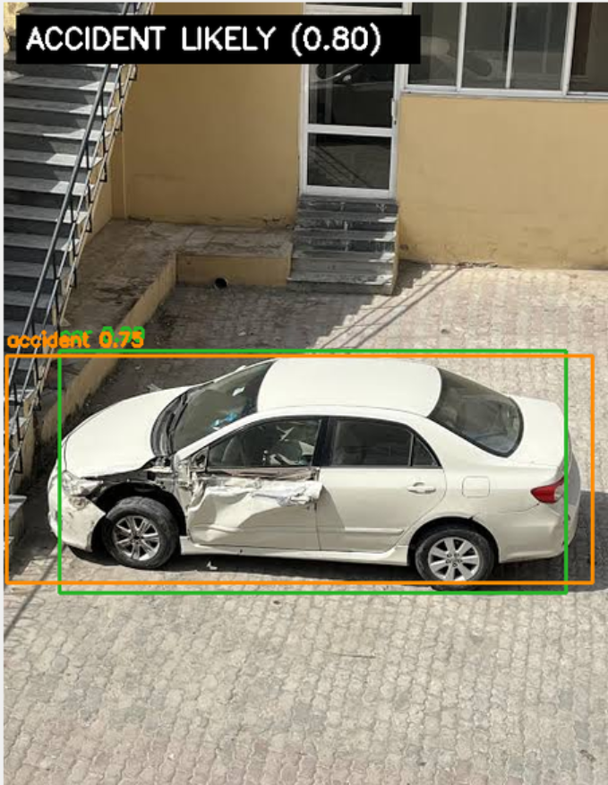
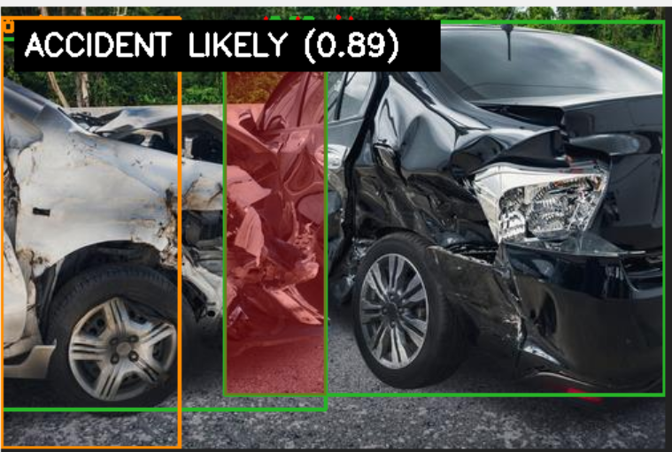

# Car Accident Detection

A prototype accident detection system for images that combines:

- YOLO-based vehicle detection
- optional accident-region detection from a trained model
- geometric reasoning for vehicle interaction
- annotated output images and structured JSON reports



## 🚀 Project Summary

This repository detects accident evidence in images and generates:

- annotated prediction images
- a JSON report with accident probability and detected objects
- an explanation of the evidence that influenced the decision

The system is designed as a prototype and is useful for research, experimentation, and dataset-driven training. It is not a production-ready safety system.

## ✅ Features

- Detects vehicles using YOLOv4 and COCO classes
- Supports optional fine-tuned accident region detection
- Combines detected vehicles and region evidence into a probability score
- Draws a single merged accident region box for cleaner visualization
- Produces a JSON report with detected vehicles, accident score, contact regions, and explanation

## 📷 Example Output



## Getting Started

### Prerequisites

- Python 3.10+ recommended
- `pip` installed

### Install dependencies

```bash
pip install -r requirements.txt
```

### Run inference on an image

```bash
python app.py --image accident2.jpg
```

### Save annotated output and JSON report

```bash
python app.py --image accident2.jpg --output outputs/images/result.jpg --json outputs/reports/result.json
```

## 🧠 How it works

1. `model_loader.py` loads YOLOv4 model files and COCO class labels.
2. `detect_vehicles.py` detects vehicles and filters only relevant classes.
3. `damage_detector.py` loads an optional trained accident-region YOLO model and detects accident evidence.
4. `accident_classifier.py` computes a probability score using vehicle overlap, distance, and region confidence.
5. `visualize.py` renders the final annotated image.

## 🛠️ Training an accident-region detector

This repository includes a dataset preparation pipeline for the Hugging Face dataset `justjuu/traffic-accident-cctv-object-detection`.

### Prepare the dataset

```bash
python prepare_hf_dataset.py
```

For a quick smoke test:

```bash
python prepare_hf_dataset.py --max-items 5
```

### Train the model

```bash
python train_accident_detector.py --epochs 30
```

The training output is expected at:

```text
runs/detect/accident_detector/weights/best.pt
```

Use the trained model explicitly:

```bash
python app.py --image accident2.jpg --accident-model runs/detect/accident_detector/weights/best.pt
```

## 📁 Repository Structure

- `app.py` — main inference entry point
- `gui.py` — desktop GUI for image selection and detection
- `detect_vehicles.py` — vehicle detector using YOLOv4
- `damage_detector.py` — optional accident-region detector
- `accident_classifier.py` — accident scoring and evidence aggregation
- `visualize.py` — result drawing and annotation
- `model_loader.py` — downloads and loads YOLO files
- `prepare_hf_dataset.py` — transforms Hugging Face data into YOLO format
- `train_accident_detector.py` — trains a YOLO accident-region model
- `config.py` — model paths, thresholds, and constants
- `requirements.txt` — Python package dependencies

## ⚠️ Notes

- The current system is a prototype and should not be used for safety-critical decisions.
- Accuracy depends heavily on the quality of the trained accident-region model.
- The vehicle detection path works even if the accident-region model is not available.

## 🚧 Future improvements

- train an end-to-end accident classifier with more labeled data
- improve region clustering and accident localization
- support multi-frame or video-based collision detection
- add performance metrics and benchmark results

## 📬 Contributions

Contributions, issues, and suggestions are welcome. If you improve model accuracy or dataset handling, please open a pull request.

---

Built for experimental accident detection and research.
